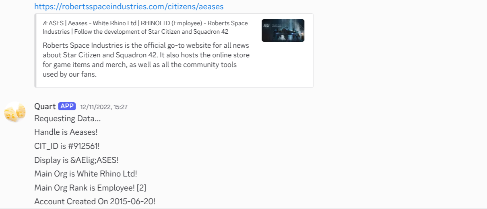
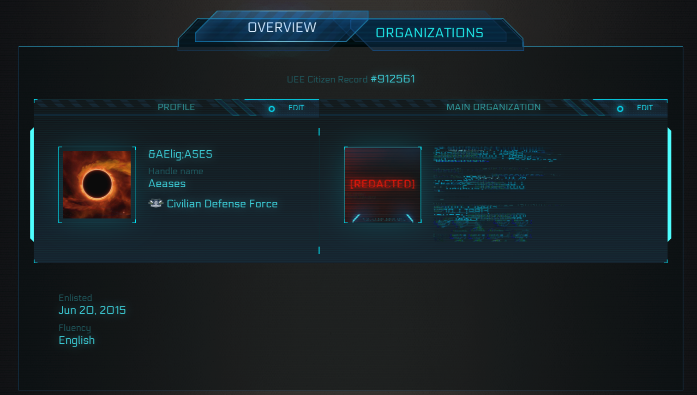
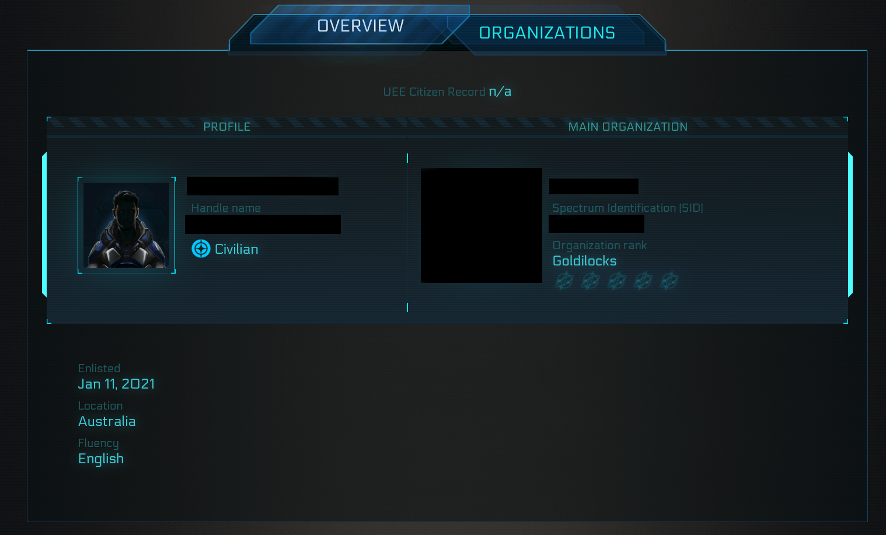

A Discord bot for detecting renamed players in the video game star citizen. Made so that my group could figure out if a player you see on radar was one that had attacked you previously so you can prepare.

The premise is that it detects if someone you have inputted into the system previously has changed their name. 
First, a URL to a player's RSI account is put into the bot. Then the information associated with their account is stored in a sqlite database.

If that players RSI account URL is again inputted, it should detect and notify the user if they've been inputted in the past. In most cases this is done using the "Citizen ID" a built in identifier for each account. 

**However** for some reason some accounts don't have a Citizen ID, with it instead showing `n/a`

In which case it should use a fallback, using information that is available on every account (Account Creation Date, Fluency, n/a status) to provide options of who that account *could* possibly be linked to.

I never finished it though, as I had exams and stopped playing star citizen consistently afterwards, this project was my original motivation for learning to program though.
