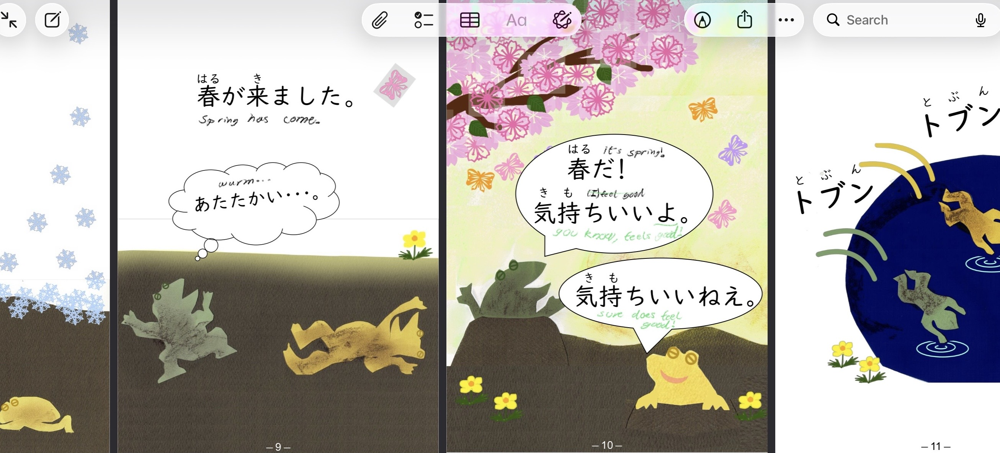

Materials I used, in order of first to last used;
- [You can Kana](https://store.steampowered.com/app/1031900/You_Can_Kana__Learn_Japanese_Hiragana__Katakana/) 
- [Tei Kims Guide](https://guidetojapanese.org/learn/) 
- [Cure Dolly Guide](https://www.youtube.com/@organicjapanesewithcuredol49) 
- [Anki Core 2K Deck](https://ankiweb.net/shared/info/1880390099)
- [Tadoku Graded Readers](https://tadoku.org/japanese/en/free-books-en/)
- [Remembering the Kanji 1](https://www.amazon.com.au/Remembering-Kanji-Complete-Japanese-Characters/dp/0824835921) By James W. Heisig

### Tei Kim & Cure Dolly
Both Tei Kim's and Cure Dolly are guides, but they both offer very different perspectives, to the point where Cure Dolly even has a [roast playlist](https://youtube.com/playlist?list=PLg9uYxuZf8x9hoAsh5-fjGDBw-17O5oTy&si=RjNeGxYvID9RWX_9) pointing out issues with Tei Kim's.

For example, **Tei Kim** says が is the identifier particle, and は is the topic particle, he provides examples to show where you should use each etc. but it wasn't enough as someone with no prior experience. 

**Cure Dolly** on the otherhand groups が in with the "*Logical particles*"   (が,を,に,へ,で) and は with the "*Nonlogical particles*" (は,も), and shows how each group effects the sentence as you switch them out for eachother. 

I did end up doing a once-over of all Tei Kim's guide before finding Cure Dolly and I continued to referenced it after since its much easier to search through then Cure Dolly's youtube channel. I just think his explanations miss some of the nuance of what is going on under-the-hood that actually makes it memorable, he just throws new concepts at you and says what they mean.

### Anki
Definitely a must, Cure Dolly recommends building a deck from scratch but I started  off with the Core 2K Deck at first, after finishing that I started making my own cards, using;
- [Yomitan](https://yomitan.wiki/) - For pop-up dictioanry and sending cards to Anki
- [Asbplayer](https://docs.asbplayer.dev/docs/intro/) - For watching videos with toggle-able simultaneous english & japanese subtitles
- [Asbplayer Web Socket Server](https://docs.asbplayer.dev/docs/guides/one-click-mining) - For intercepting Yomitan cards sent to Anki and automatically adding audio and screenshots from Asbplayer to the card

With these setup you can create a flashcard with a single click. It is more of a hassle then paying for something like [Migaku](https://migaku.com/) but it is completely free.

### Tadoku-Graded-Readers
These are free books that are extremely simple, I started reading them like a week after starting Anki

### Remembering The Kanji I
Remembering The Kanji is a book that teaches you kanji by first introducing radicals, then making all the kanji possible out of them before introducing more radicals. It makes them memorable by associating an idea or concept with each radical, then creating memorable (sometimes slightly disturbing) stories by combining all the ideas given by the radicals in a given kanji together.

I only did the first 200 kanji of the 2,200 in the book, Personally it wasn't useful for learning kanji directly, that happened in Anki, but it **was** really useful for learning how to learn kanji, i.e. how to identify radicals and stuff, this made it much easier to differentiate kanji that I previously got mixed up.
