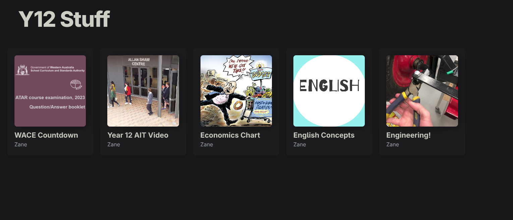
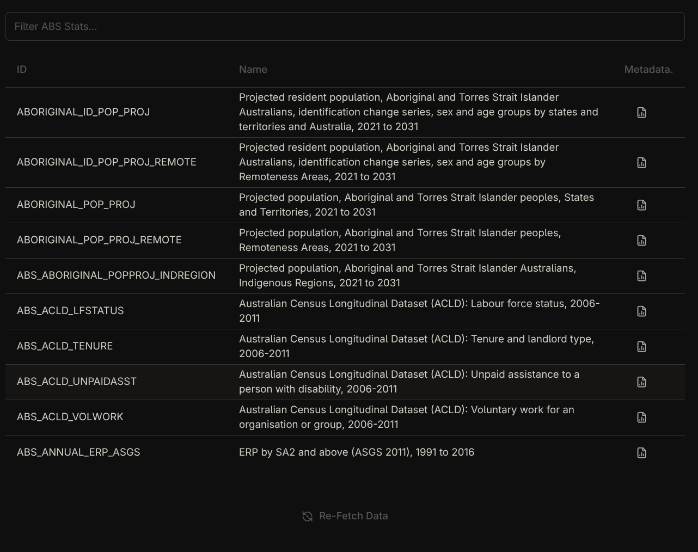
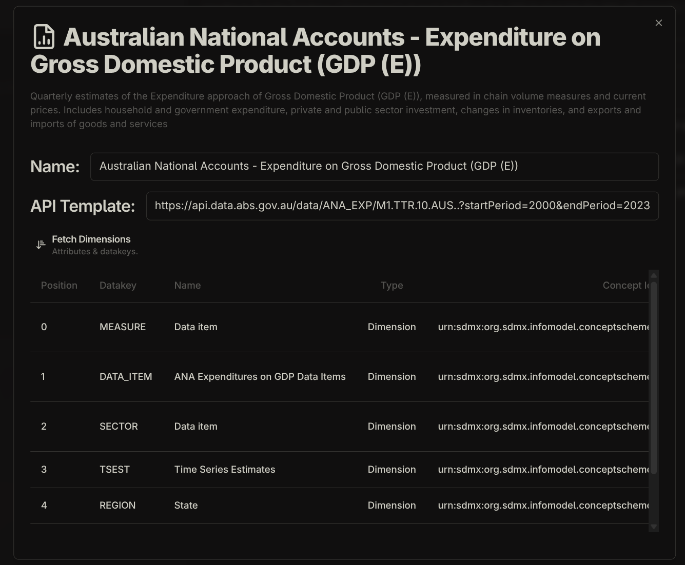

I started creating this site just before uni, it uses Astro which can render to static HTML files so that hosting is cheap and easy.

### Old Sites
This was an old site I made in Year 12 to aggregate a couple different projects I was working on at the time;

##### Economics Chart
This used the ABS's (Australian Bureau of Statistics) API, which at the time had just been released as version 0.0.1. It graphed multiple types of data alongside eachother, unfortunately the API version has been updated and the original version 0.0.1 has been discontinued, which broke it so I haven't got a screenshot :(

It also allowed you to view all the different types of data the ABS API had available as can be seen below;

 and when you click on the metadata icon, the fields associated with that data are shown too;

##### 'English Concepts' / 'Engineering'
These were just my Obsidian notes uploaded online for easier sharing e.g;

This should've been trivial since Obsidian stores everything as markdown, however they added some new extensions to markdown, (e.g. callouts) that were not standard in popular markdown implementations like remark, so I had to manually create and style these to appear the same as they did in my notes. Some of that code has been re-used in this site too.