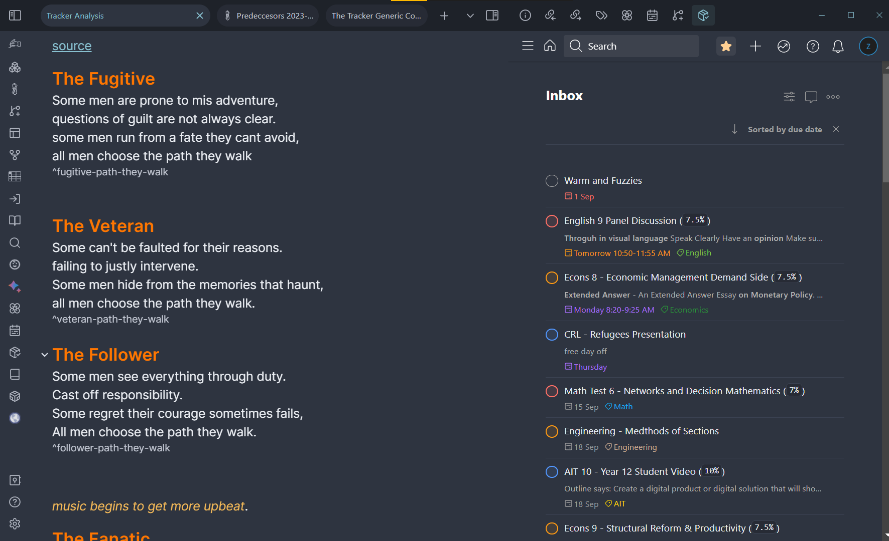

[Obsidian Webviews](https://github.com/Aeases/obsidian-webviews) was a plugin I made based on another plugin called [Opengate](https://github.com/nguyenvanduocit/obsidian-open-gate).

It allowed you to open up any website as a tab inside of obsidian and manually override the styles of those sites to look like they are apart of the app. E.g. See below for a example of [Todoist](https://www.todoist.com/) being shown on the right-hand side of this obsidian page.

This was my first time dealing with object-orientated programming for real, (outside of Minecraft modding).